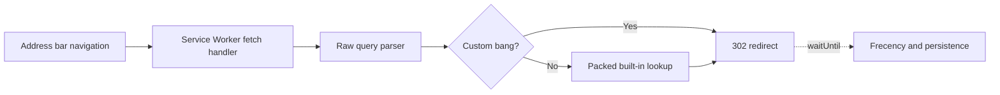

# flashbang

<p>
  <a href="https://dash.cloudflare.com/?to=/:account/workers-and-pages"></a>
  <a href="https://railway.com/deploy/flashbang?referralCode=cxTxcH&amp;utm_medium=integration&amp;utm_source=template&amp;utm_campaign=generic"></a>
</p>

<p>
  <a href="https://github.com/ph1losof/flashbang/releases/latest"></a>
  <a href="https://github.com/ph1losof/flashbang/actions/workflows/ci.yaml"></a>
  <a href="https://github.com/ph1losof/flashbang/actions/workflows/codeql.yaml"></a>
  <a href="https://github.com/ph1losof/flashbang/actions/workflows/update-bangs.yaml"></a>
  <a href="LICENSE"></a>
  <a href="package.json"></a>
</p>


<p align="center"><a href="#features">Features</a> &nbsp;|&nbsp; <a href="#bang-syntax">Bang syntax</a> &nbsp;|&nbsp; <a href="#snap-syntax">Snap syntax</a> &nbsp;|&nbsp; <a href="#setup-as-search-engine">Setup</a> &nbsp;|&nbsp; <a href="#deploy-your-own">Self-host</a> &nbsp;|&nbsp; <a href="#how-it-works">How it works</a> &nbsp;|&nbsp; <a href="#comparison-with-other-bang-tools">Comparison</a> &nbsp;|&nbsp; <a href="#contributing">Contributing</a></p>

Turn your browser's address bar into a shortcut launcher. Type `!g kittens` to search Google, `!w dogs` for Wikipedia, `!gh react` for GitHub — over 14,000 shortcuts (called "bangs") that take you straight to the right site, instantly. No extra tabs, no round-trips, no waiting for a page to load. Or use **snaps** — type `@w quantum` to search your default engine restricted to Wikipedia, `@gh api` for GitHub-only results.

Other bang tools load a full page before redirecting — adding hundreds of milliseconds — or routes through an edge server adding network latency. Flashbang skips the page entirely — a [Service Worker](https://developer.mozilla.org/en-US/docs/Web/API/Service_Worker_API) handles the redirect before your browser even starts rendering.

### Try it now

Visit **[flashbang.tech](https://flashbang.tech)** — if your browser supports [OpenSearch](https://developer.mozilla.org/en-US/docs/Web/OpenSearch), flashbang will appear in your search engine list automatically. Otherwise, add **`https://flashbang.tech?q=%s`** as a custom search engine in your browser. Optionally, set **`https://flashbang.tech/suggest?q=%s`** as the suggestion URL for address bar autocomplete. That's it.

> **Note for Microsoft Edge users:** Edge needs a one-time setup tweak (the auto-discovered entry has to be deleted and re-added manually) — see [Browser quirks](#browser-quirks). Without it, your default search engine gets overwritten after the first bang you use.

### Already using DuckDuckGo, Brave, or Kagi?

All three support bangs natively — but every query still round-trips through their servers before redirecting, adding significant network latency you can feel. Flashbang's Service Worker resolves the bang locally in sub 1ms and redirects before any network request leaves your machine. You also get bang-aware search suggestions in your address bar, custom bangs, feeling lucky, and it works in any browser — not just the one your engine ships with.

### Privacy

> Core redirects never leave your machine once installed — the Service Worker handles them offline with no server involved. Search suggestions are completely optional and go through our server when enabled on the hosted version. One same-site cookie (`suggest`) stores your configured suggestion provider, default bang, selected bang/snap prefixes, optional custom suggestion URL, custom bang trigger names, and compact top bang usage counts so the server can proxy and personalize suggestions. The frecency section contains only bang triggers and hit counts (e.g. `g:50.yt:30`), never query content. No accounts, no sessions, no personal data. There is no tracking or analytics — we don't know what you search or what bangs you use. Cloudflare Pages exposes basic request counts in its dashboard as a platform feature we did not opt into and cannot disable. It contains no query content or personally identifiable information.
>
> If you'd rather not trust our server at all, Flashbang is fully self-hostable. Deploy to Cloudflare Pages/Railway in minutes or `docker run` it on any VPS — a single command gets you a fully private instance. See [Setup](#setup-as-search-engine) for details.

## Features

- **Built for speed** — The redirect parser itself runs in well under 1ms, while browser-visible latency is dominated by browser-to-Service-Worker transport and scheduling. The `/bench` page measures that fetch round trip with deterministic settings, randomized paths, a no-op transport baseline, high-resolution isolated timing, and verification that every request was handled locally. It also runs paired top-level navigations against a direct same-origin target to estimate actual redirect overhead without destination network time. The Service Worker intercepts real searches before they hit the network, parses the bang, and responds with a 302 — no page load, framework, or round-trip to Flashbang's server. [Run the benchmark yourself](https://flashbang.tech/bench) — results vary by browser and machine
- **Zero runtime deps** — Ships without production npm dependencies; redirects run on plain browser APIs in the Service Worker
- **Private** — No analytics, no tracking. All data stays on your device for the core feature - redirects
- **14,000+ bangs** — Merged from DuckDuckGo, Kagi, and custom sources. Updated daily via automated CI
- **Custom bangs** — Add your own bangs through the settings UI. They take priority over built-ins
- **Configurable syntax** — Choose distinct bang and snap prefixes from `!`, `@`, `$`, `:`, `;`, and `~`. Defaults are `!` for bangs and `@` for snaps. The selected bang prefix also controls bare Feeling Lucky forms; leading `\query` always remains available
- **Search suggestions** — The only bang tool with bang-aware autocomplete in your browser's native address bar. Type `!y` and the browser itself suggests `!yt` (YouTube), `!ya` (Yandex), `!yf` (Yahoo Finance) — ranked by a combination of global popularity and your personal usage frequency. Regular queries can use Google, DuckDuckGo, Bing, Brave, Yahoo, Ecosia, Kagi, Qwant, Startpage, Yandex, or Baidu. Self-hosted deployments can explicitly opt into custom providers. Both are unified through a single `/suggest` endpoint that plugs into your browser's built-in suggestion UI. Firefox-based browsers also render bang descriptions, site names, and favicons inline in the dropdown via `google:suggestdetail`. See [Browser quirks](#browser-quirks) for rendering and cookie differences across browsers
- **Frecency** — The Service Worker tracks which bangs and snaps you use and how often, entirely in-memory on the redirect path. Your most-used triggers are promoted in autocomplete suggestions so they surface first. Compact snapshots are persisted to IndexedDB across Service Worker restarts. Suggestion personalization is available in Chromium-based browsers; it is not available in Firefox-based browsers — see [Browser quirks](#browser-quirks)
- **Snaps and snap chains** — Type `@trigger query` to restrict results to one site, or chain 2–8 sites with `@gh,so,mdn query`. Prefix (`@w quantum`) and suffix (`quantum @w`) positions both work. A bare single snap (`@w`) redirects to the trigger's homepage. Snaps reuse bang triggers; entries without a resolvable web domain, such as the internal `settings` shortcut, fall back to a normal search
- **Feeling Lucky** — Prefix a query with `\`, or add the selected bang prefix before or after it, to skip the results page and jump straight to the first result. The bang prefix defaults to `!`; selecting another prefix replaces those bare `!` forms, while `\` remains available. The default mode matches Google, DuckDuckGo, or Kagi when one of those is your default engine, and falls back to DuckDuckGo for other engines. You can also select a provider, use a custom URL, or disable it entirely
- **OpenSearch** — Browsers auto-discover Flashbang as a search engine via `/opensearch.xml`, including the suggestions endpoint. The XML is dynamically generated at request time using the current origin, so it works out of the box on any self-hosted domain or `localhost` — no hardcoded URLs to change

## Configurable syntax

Settings lets you select different prefixes for bangs and snaps from `!`, `@`, `$`, `:`, `;`, and `~`. Changing a prefix replaces that syntax rather than adding an alias. For example, with `$` for bangs and `~` for snaps, use `$gh react`, `react $gh`, `~w quantum`, and `quantum ~w`; `!gh` and `@w` become ordinary search text. The examples below use the default `!` and `@` prefixes.

Firefox-based browsers do not reliably show remote suggestions when address-bar input begins with `:`. A prefix snap such as `:gh` may have no suggestion dropdown even though a query-first snap such as `test :gh` does. Prefer `@` or `~` for snaps if you want prefix autocomplete in Firefox, Zen, or LibreWolf.

## Bang syntax

Flashbang supports 4 formats. All bangs are case-insensitive.

| Format              | Example      | Result                      |
| ------------------- | ------------ | --------------------------- |
| Prefix bang         | `!g kittens` | Google search for "kittens" |
| Suffix bang         | `kittens g!` | Google search for "kittens" |
| Prefix, query first | `kittens !g` | Google search for "kittens" |
| Suffix, bang first  | `g! kittens` | Google search for "kittens" |

If the query is just a bang with no search term (e.g. `!g`), Flashbang redirects to the service's homepage.

## Snap syntax

By default, snaps use `@` instead of `!` to perform a **site-restricted search** — your query goes to your default search engine with `site:domain` appended. Any bang trigger with a resolvable web domain works as a snap. All snaps are case-insensitive.

| Format      | Example      | Result                                                    |
| ----------- | ------------ | --------------------------------------------------------- |
| Prefix snap | `@w quantum` | Default engine search for "quantum site:en.wikipedia.org" |
| Suffix snap | `quantum @w` | Default engine search for "quantum site:en.wikipedia.org" |
| Bare snap   | `@gh`        | Redirect to github.com homepage                           |

### Snap chains

Chain 2–8 sites with one snap prefix and comma-separated shortcuts. For example, `@gh,so,mdn,w service workers` searches for `service workers (site:github.com OR site:stackoverflow.com OR site:developer.mozilla.org OR site:en.wikipedia.org)`. The suffix form, `service workers @gh,so,mdn,w`, works too.

The chain preserves target order, removes duplicate domains and paths, and requires every shortcut to resolve to a valid snap target. Custom bangs and custom snap paths are supported. Autocomplete operates on the current segment, so `@gh,so,m` suggests completions such as `@gh,so,mdn` without repeating already-selected shortcuts.

If a query contains both a bang (`!`) and a snap (`@`), the bang takes precedence. Unknown snap triggers, and triggers without a resolvable web domain, fall back to a normal default search.

### Feeling Lucky

Skip the search results page and go directly to the first result. The table uses the default bang prefix; if you change it, the leading/trailing bare marker changes with it. Leading backslash remains fixed.

| Format       | Example     | Result                     |
| ------------ | ----------- | -------------------------- |
| Backslash    | `\kittens`  | First result for "kittens" |
| Trailing `!` | `kittens !` | First result for "kittens" |
| Leading `!`  | `! kittens` | First result for "kittens" |

The redirect destination depends on your lucky provider (configurable in settings):

- **Default (match bang)** — Uses your default search engine's native lucky feature if available (Google `btnI`, DuckDuckGo `\`), otherwise falls back to DuckDuckGo's `\` redirect
- **Google** / **DuckDuckGo** / **Kagi** — Always use that engine's lucky redirect
- **Custom** — Provide your own URL template with `{}` as the query placeholder
- **Disabled** — Lucky syntax is treated as a normal search query

## Setup as search engine

### Use the hosted version

A public instance is available at **[flashbang.tech](https://flashbang.tech)**. Just visit it, then add it as a custom search engine in your browser:

- **Search URL:** `https://flashbang.tech?q=%s`
- **Suggestion URL:** `https://flashbang.tech/suggest?q=%s` (Optional)

Nothing to build or deploy.

For maximum query privacy, use `https://flashbang.tech/#q=%s`. Everything after `#` is a URL fragment, which browsers do not include in the HTTP request to Flashbang. Once installed, Flashbang's Service Worker reads and resolves the fragment locally, then loads a minimal synthetic page to navigate without carrying the private fragment to the destination. This extra page is slower and may briefly flash during navigation. On a first visit, the page fallback resolves the query in the browser instead. The standard `https://flashbang.tech?q=%s` URL is significantly faster and is recommended unless keeping the very first query request (which happens one time at SW install) out of to Flashbang's hosted server is more important than redirect speed.

> **Note:** Search suggestions and OpenSearch auto-discovery require a server endpoint since browsers don't route these requests through Service Workers — both are completely optional. Redirects always work offline once installed with no server needed. If you use the hosted version, these requests go through our Cloudflare Pages Functions. No queries are logged or stored — self-host if you'd rather keep them local too.

### Suggestion URL parameters

The suggestion endpoint accepts cookie-independent query parameters for the suggestion provider and shortcut syntax:

- `sp` selects the suggestion provider
- `bp` selects the bang prefix
- `np` selects the snap prefix

`bp` and `np` must be supplied together, must differ, and each accepts `!`, `@`, `$`, `:`, `;`, or `~`. Invalid pairs safely fall back to cookie or default settings. Provider values are:

```text
google, ddg, bing, brave, yahoo, ecosia, kagi, qwant, startpage, yandex, baidu, none
```

Example Firefox suggestion URL with provider and syntax overrides:

```text
https://flashbang.tech/suggest?q=%s&sp=ddg&bp=%24&np=~
```

**Why this exists:** in Chromium-based browsers, cookies are sent with suggest requests and settings configured in the UI are picked up automatically, so these overrides are rarely needed. Firefox-based browsers withhold cookies; the settings UI therefore generates a copyable URL containing `sp`, and adds `bp` plus `np` when the selected syntax differs from the default `!`/`@` pair. See [Browser quirks](#browser-quirks) for details.

### Browser quirks

These apply equally to the hosted version and any self-hosted instance — worth a quick read before adding flashbang as your default.

- **Microsoft Edge — bang destinations hijack the default search.** After you use a bang like `!gm`, Edge auto-registers the destination (Google Maps, GitHub, etc.) as a separate search engine with the _same_ shortcut as flashbang (the host). When two engines share a shortcut, Edge picks the most-recently-used one for default searches — so your plain queries start going to Google Maps. Not observed in Chrome or Firefox.

  **Fix** — in `edge://settings/searchEngines`:
  1. Delete the auto-discovered flashbang entry.
  2. Click **Add** and re-add it manually:
     - **Search engine:** `flashbang`
     - **Shortcut:** something short and unique like `f`
     - **URL with %s:** `https://flashbang.tech?q=%s` (or your self-hosted URL)
  3. Set it as your default.

  **Important:** _editing_ the auto-discovered entry's Shortcut doesn't persist — Edge re-derives it from `/opensearch.xml` on restart and reverts to the host. The delete-and-readd step is what makes the fix stick, because a manually-added entry is independent of the discovery XML.

- **Firefox / Zen / LibreWolf — no frecency, no custom bangs in suggestions.** Firefox-based browsers intentionally [withhold cookies from OpenSearch suggest requests](https://bugzilla.mozilla.org/show_bug.cgi?id=1624457) as a privacy measure. Flashbang's custom bang trigger names and frecency data are carried by the unified `suggest` cookie, so those features remain unavailable on these requests. Provider and bang/snap prefix settings can be embedded directly with `sp`, `bp`, and `np`; the settings UI generates the complete URL — see [Suggestion URL parameters](#suggestion-url-parameters).

- **Tor Browser and Safari Lockdown Mode — slower fallback.** These privacy modes can disable Service Workers, which Flashbang normally uses for local redirects. Flashbang falls back to loading the same bang data and resolving the query in the page, so redirects still work but require a network page load and do not have the normal sub-millisecond or offline guarantees. The query is still resolved in your browser, not by Flashbang's server.

- **Chromium — plain-text suggestions only.** Chrome, Edge, Arc, and other Chromium-based browsers don't render rich suggestion details (descriptions, favicons, entity images) for search-type suggestions from custom search engines; they're shown as plain text. Firefox-based browsers render the rich data passed through `google:suggestdetail`. This is a Chromium limitation, not flashbang's.

### Deploy your own

**Cloudflare Pages** (recommended) — supports both redirects and suggestions out of the box:

1. Deploy the repo to Cloudflare Pages with build command `bun run codegen --from-merged && bun run build` and output directory `dist`
2. The Pages Functions automatically handle `/suggest` (search suggestions) and `/opensearch.xml` (search engine discovery with correct origin) on the edge
3. Visit the site — your browser will auto-discover it via OpenSearch
4. Or manually add a custom search engine:
   - **Search URL:** `https://your-domain?q=%s`
   - **Suggestion URL:** `https://your-domain/suggest?q=%s`

**Railway** — detects the Dockerfile and deploys automatically:

1. Connect your repo on [Railway](https://railway.app)
2. Railway builds the Docker image and sets the `PORT` environment variable automatically
3. Connect domain (you can auto-generate it in settings)
4. Add a custom search engine:
   - **Search URL:** `https://your-app.up.railway.app?q=%s`
   - **Suggestion URL:** `https://your-app.up.railway.app/suggest?q=%s`

For deployments behind a reverse proxy or TLS terminator, set `PUBLIC_ORIGIN` to the browser-visible URL (for example, `https://search.example.com`). OpenSearch uses this value instead of the request URL. It must be an absolute `http://` or `https://` URL without credentials; any trailing slash, path, query, or fragment is discarded. If it is unset, Flashbang uses the request origin, preserving the default Cloudflare Pages behavior. If it is set but invalid, `/opensearch.xml` returns `500` rather than publishing incorrect or unsafe URLs.

Custom suggestion URLs are disabled by default because they allow the server to proxy requests to arbitrary destinations. A trusted self-hosted deployment can opt into the previous behavior by setting `ALLOW_UNSAFE_CUSTOM_SUGGEST_URLS=true` during both the build and at runtime. The setting is compiled into the UI, so changing it requires rebuilding and redeploying. Do not enable this on a public instance.

**Other static hosts** (Netlify, Vercel, etc.) — redirects work, but suggestions and dynamic OpenSearch require adding serverless functions for `/suggest` and `/opensearch.xml`. See `functions/` for the implementations — they reuse shared modules from `src/` and can be adapted to any serverless platform.

### Self-host with Docker (recommended)

Run your own instance on any VPS. No dependencies to install — just Docker:

```sh
docker build -t flashbang .
docker run -p 3000:3000 flashbang
```

To include custom suggestion URLs in a private Docker deployment, build with `docker build --build-arg ALLOW_UNSAFE_CUSTOM_SUGGEST_URLS=true -t flashbang .`. The image uses the same value as its runtime default.

The image uses a multi-stage build — fetches bang sources, builds assets, and produces a minimal runtime image. Static assets are pre-compressed with Brotli at build time and served automatically, falling back to uncompressed for clients that don't support it. The port is configurable via the `PORT` environment variable (`-e PORT=8080`); `PUBLIC_ORIGIN` configures the browser-visible origin when running behind a reverse proxy (for example, `-e PUBLIC_ORIGIN=https://search.example.com`).

For a remote deployment, terminate TLS with a reverse proxy or hosting provider and expose Flashbang over HTTPS. Browsers only enable Service Workers in secure contexts (HTTPS or localhost), and Flashbang's suggestion settings cookie is `Secure`. Plain HTTP on a VPS will not provide worker redirects or persistent suggestion settings. Set the HTTPS origin as your browser's custom search engine:

- **Search URL:** `https://search.example.com?q=%s`
- **Suggestion URL:** `https://search.example.com/suggest?q=%s`

### Self-host without Docker

Requires [Bun](https://bun.sh). Service Workers require HTTPS except on `localhost`; a local HTTP server works because browsers treat localhost as a secure context:

```sh
bun run codegen && bun run build && bun run start
```

`bun run codegen` fetches the latest bang definitions from DuckDuckGo and Kagi and generates the JavaScript bang maps. `bun run build` bundles, minifies, and pre-compresses all static assets with Brotli into `dist/`. `bun run start` serves the production build locally. Visit the local URL once — the Service Worker installs and redirects work offline after that. Set it as your browser's custom search engine:

If generated bang artifacts are missing, `bun run build` and `bun run profile` automatically run `bun run codegen --from-merged` before continuing.

- **Search URL:** `http://localhost:3000?q=%s`
- **Suggestion URL:** `http://localhost:3000/suggest?q=%s` (Optional)

To pick up new bangs, pull the latest changes and re-run `bun run codegen`. If you host it, the daily GitHub Actions CI does this automatically.

The settings page has a copy button that gives you the exact search URL template.

## Settings

Open the settings modal from the gear icon on the home page, or type **`!settings`** in the address bar to jump there directly. Type **`!`** on its own to quickly access the home page.

- **Shortcut syntax** — Choose distinct bang and snap prefixes from `!`, `@`, `$`, `:`, `;`, and `~`. Defaults are `!` and `@`
- **Default bang** — The built-in bang used when no selected bang prefix is in the query. Defaults to `g` (Google). Change it to `ddg`, `b`, or any other built-in trigger
- **Feeling Lucky** — Choose how lucky redirects resolve: Default (match Google, DuckDuckGo, or Kagi when selected as the default bang, otherwise fall back to DuckDuckGo), Google, DuckDuckGo, Kagi, Custom (your own URL template with `{}` as query placeholder), or Disabled
- **Search suggestions** — Choose the source for address bar autocomplete: Default (match a supported default bang, otherwise return no regular-query suggestions), Google, DuckDuckGo, Bing, Brave, Yahoo, Ecosia, Kagi, Qwant, Startpage, Yandex, Baidu, Custom (self-hosted deployments with `ALLOW_UNSAFE_CUSTOM_SUGGEST_URLS=true` only), or None
- **Custom bangs** — Add bangs with a trigger, name, and URL template (use `{}` as the query placeholder). Advanced bangs can match the query with a regular expression, substitute `$1`, `$2`, etc., and set a separate domain or path for `@snap` searches. Custom bangs override built-in ones
- **Search bangs** — Real-time search across all 14,000+ bangs by trigger, name, or domain
- **Import/Export** — Export your settings and custom bangs as JSON. Import to restore or sync across devices

All settings are stored in IndexedDB locally on your device.

For example, a capture bang with URL `https://translate.example/$1/$2` and regex `(\w+)\s+(.*)` turns `!trurl ja https://example.com` into a URL containing `ja` and the encoded source URL. Capture values can use percent, plus-space, or raw encoding.

An optional snap target such as `docs.example.com/api` makes `@mybang query` search only that domain and path, while `!mybang query` continues to use the bang's normal URL.

## How it works

The redirect path is deliberately separate from the website UI and from the suggestion server:



### Redirect before render

When you type `!gh react` (or the equivalent with your selected bang prefix), the browser navigates to Flashbang's search URL. The installed Service Worker intercepts that navigation, reads `q` directly from the raw request URL, resolves the destination, and returns `Response.redirect(..., 302)`. The browser follows that response without loading or rendering the Flashbang page.

The parser works on the still-encoded query instead of first passing the whole value through `URLSearchParams`, decoding it, and encoding it again. It recognizes literal and percent-encoded markers and spaces, computes the trigger's FNV-1a hash while extracting it, and preserves the raw search term where the destination template allows it. Custom bangs are checked first; built-ins are checked only if there is no custom override. The same parser handles all prefix/suffix bang forms, lucky syntax, snaps, and snap chains. Unknown syntax safely becomes a search through the configured default engine.

### A search catalog compiled like an index

The 14,000+ source records are not shipped to the redirect worker as a large JSON object. `scripts/codegen.ts` merges and validates the DuckDuckGo, Kagi, and project-specific sources, then produces purpose-built artifacts for different jobs:

- `bangs.bin` contains the regular trigger-to-URL redirect index
- generated sparse data handles advanced capture/regex bangs
- a packed radix trie powers prefix autocomplete and snap-chain completion
- `bangs-meta.bin` contains the names and domains needed by the settings UI
- a tiny generated hot-bang table covers common triggers during worker startup

For the redirect index, codegen splits every URL template around its query placeholder, deduplicates the resulting prefixes and suffixes, and stores compact IDs plus byte lengths in typed arrays. It also deterministically builds a CHD-style minimal perfect hash from each trigger's FNV-1a hash and writes records directly in hash-slot order. A lookup therefore selects one slot with no probe loop, verifies that the stored trigger really matches, and only then decodes and caches that entry's URL pieces. Most of the catalog remains byte-backed for the worker's lifetime.

### Fast restarts and offline redirects

Service Workers can be stopped whenever the browser considers them idle, so in-memory state cannot be assumed to survive. The full binary index is cached in Cache Storage, while settings, custom bangs, and compact frecency snapshots live in IndexedDB.

Flashbang also keeps a compact **hot-boot record** in the Service Worker's persisted navigation-preload configuration while leaving navigation preload itself disabled. That record can contain redirect settings and the user's top frecent bang URLs. Together with the generated hot-bang table, it lets a newly started worker answer common navigations before IndexedDB and the full binary catalog have finished loading. A miss falls through to the cached full index, so this optimization never changes redirect semantics. Browsers without the required API simply use the normal cache and IndexedDB path.

### No storage work on the response path

Destination resolution is synchronous once the required lookup state is available. After the 302 has been created, `FetchEvent.waitUntil()` schedules usage counting, coalesced IndexedDB persistence, hot-boot refreshes, and suggestion-cookie updates. Frecency can therefore personalize later autocomplete results without putting an IndexedDB write in front of the current redirect.

### Suggestions use a different data structure

Browsers send OpenSearch suggestion requests to `/suggest`; they do not route them through the Service Worker. Bang completion is still local to the Flashbang deployment: the endpoint walks a generated radix trie whose nodes carry the maximum relevance of their descendants, then performs a bounded top-k search that prunes branches unable to beat the current results. Global relevance, optional frecency boosts, custom triggers, and already-selected snap-chain targets are combined during that walk. Regular non-bang queries are proxied to the configured suggestion provider and are never added to the bang catalog or frecency data.

The privacy-first `#q=%s` URL takes a related but intentionally slower path. The query remains in the URL fragment, which is not sent to the server. The Service Worker resolves it locally and returns a minimal synthetic page that calls `location.replace()` with a safely serialized destination; this prevents the private source fragment from being carried into the destination URL.

See [DEVELOPMENT.md](DEVELOPMENT.md) for build pipeline and project structure details.

## Comparison with other bang tools

🥇, 🥈, and 🥉 mark first, second, and third place. Ties share a medal; subjective or effectively universal rows are not ranked.

|                                  | **flashbang**                                                                                                                                         | **[unduck](https://github.com/T3-Content/unduck)**                                                                                               | **[unduckified](https://github.com/taciturnaxolotl/unduckified)**                                                                                                         | **[ReBang](https://github.com/Void-n-Null/rebang)**                                                                                                | **[bangs.fast](https://github.com/kristianvld/bangs.fast)**                                                                                                    | **[cf-unduck](https://github.com/mynameistito/cf-unduck)**                                                                                                    |
| -------------------------------- | ----------------------------------------------------------------------------------------------------------------------------------------------------- | ------------------------------------------------------------------------------------------------------------------------------------------------ | ------------------------------------------------------------------------------------------------------------------------------------------------------------------------- | -------------------------------------------------------------------------------------------------------------------------------------------------- | -------------------------------------------------------------------------------------------------------------------------------------------------------------- | ------------------------------------------------------------------------------------------------------------------------------------------------------------- |
| **Redirect method**              | 🥇 **Service Worker intercept**                                                                                                                       | 🥉 **`window.location.replace`**                                                                                                                 | 🥉 **`window.location.replace`**                                                                                                                                          | 🥈 **Cloudflare Worker + client fallback**                                                                                                         | 🥉 **`window.location.replace`**                                                                                                                               | 🥈 **Cloudflare Worker + client fallback**                                                                                                                    |
| **When redirect happens**        | 🥇 **Before page renders (Service Worker)**                                                                                                           | 🥉 **After page loads**                                                                                                                          | 🥉 **After page loads**                                                                                                                                                   | 🥈 **At edge or after page loads**                                                                                                                 | 🥉 **After page loads**                                                                                                                                        | 🥈 **At edge or after page loads**                                                                                                                            |
| **Sources**                      | 🥇 **DDG + Kagi + custom**                                                                                                                            | DDG                                                                                                                                              | Kagi                                                                                                                                                                      | 🥈 **DDG + Kagi**                                                                                                                                  | 🥉 **Selectable DDG or Kagi datasets**                                                                                                                         | **Kagi**                                                                                                                                                      |
| **Analytics**                    | 🥇 **None†**                                                                                                                                          | Plausible                                                                                                                                        | None‡                                                                                                                                                                     | Vercel Analytics + Speed Insights                                                                                                                  | 🥇 **None (static GitHub Pages)**                                                                                                                              | Google Analytics 4 via Cloudflare Zaraz§                                                                                                                      |
| **Server required**              | 🥇 **No for redirects**; yes for optional suggestions/OpenSearch                                                                                      | 🥇 **No**                                                                                                                                        | 🥇 **No**                                                                                                                                                                 | Yes (Cloudflare Worker)                                                                                                                            | 🥇 **No**                                                                                                                                                      | Yes (Cloudflare Worker)                                                                                                                                       |
| **Snaps (`site:` search)**       | 🥇 **Yes (`@trigger`)**                                                                                                                               | No                                                                                                                                               | No                                                                                                                                                                        | No                                                                                                                                                 | No                                                                                                                                                             | No                                                                                                                                                            |
| **Snap chains**                  | 🥇 **Yes (2–8 sites)**                                                                                                                                | No                                                                                                                                               | No                                                                                                                                                                        | No                                                                                                                                                 | No                                                                                                                                                             | No                                                                                                                                                            |
| **Feeling Lucky**                | 🥇 **Yes (configurable per-engine)**                                                                                                                  | No                                                                                                                                               | No                                                                                                                                                                        | No                                                                                                                                                 | No                                                                                                                                                             | No                                                                                                                                                            |
| **Configurable shortcut syntax** | 🥇 **Yes (separate bang/snap prefixes)**                                                                                                              | No (fixed `!`)                                                                                                                                   | No (fixed `!`)                                                                                                                                                            | No (fixed `!`)                                                                                                                                     | No (fixed `!`)                                                                                                                                                 | No (fixed `!`)                                                                                                                                                |
| **Private fragment search**      | 🥇 **Yes (`#q=%s`, Service Worker)**                                                                                                                  | No                                                                                                                                               | No                                                                                                                                                                        | No                                                                                                                                                 | 🥈 **Yes (`#q=%s`, page-based)**                                                                                                                               | No                                                                                                                                                            |
| **Address-bar suggestions**      | 🥇 **Built in (bang-aware + regular queries)**                                                                                                        | No                                                                                                                                               | 🥉 **Manual Google/DDG provider URL**                                                                                                                                     | No                                                                                                                                                 | No                                                                                                                                                             | 🥈 **Built-in Google suggestions**                                                                                                                            |
| **Frecency-ranked suggestions**  | 🥇 **Yes (local usage; Chromium)**                                                                                                                    | No                                                                                                                                               | No                                                                                                                                                                        | No                                                                                                                                                 | No                                                                                                                                                             | No                                                                                                                                                            |
| **OpenSearch**                   | 🥇 **Yes (dynamic, self-host friendly)**                                                                                                              | No                                                                                                                                               | 🥈 **Yes (static)**                                                                                                                                                       | 🥈 **Yes (static)**                                                                                                                                | 🥈 **Yes (static)**                                                                                                                                            | 🥈 **Yes (static)**                                                                                                                                           |
| **Default engine setting**       | Yes                                                                                                                                                   | `localStorage` only; no UI                                                                                                                       | Yes                                                                                                                                                                       | Yes                                                                                                                                                | Yes                                                                                                                                                            | Yes                                                                                                                                                           |
| **Custom bangs**                 | 🥇 **Yes (IndexedDB + navigation-preload hot boot)**                                                                                                  | No                                                                                                                                               | 🥉 **Yes (`localStorage`)**                                                                                                                                               | 🥉 **Yes (`localStorage`)**                                                                                                                        | 🥈 **Yes (IndexedDB)**                                                                                                                                         | 🥉 **Yes (`localStorage` + cookie)**                                                                                                                          |
| **Advanced custom bangs**        | 🥇 **Regex captures, encoding modes, custom snap paths**                                                                                              | No                                                                                                                                               | No                                                                                                                                                                        | No                                                                                                                                                 | No                                                                                                                                                             | No                                                                                                                                                            |
| **Bang catalog search**          | Yes (trigger, name, or domain)                                                                                                                        | No                                                                                                                                               | Yes                                                                                                                                                                       | Yes                                                                                                                                                | Yes                                                                                                                                                            | Yes                                                                                                                                                           |
| **Settings import/export**       | 🥇 **Yes**                                                                                                                                            | No                                                                                                                                               | 🥇 **Yes**                                                                                                                                                                | No                                                                                                                                                 | 🥈 **Shareable settings link**                                                                                                                                 | No                                                                                                                                                            |
| **Automatic bang updates**       | Daily                                                                                                                                                 | No                                                                                                                                               | Daily                                                                                                                                                                     | Monthly (PR)                                                                                                                                       | Daily                                                                                                                                                          | Daily (PR)                                                                                                                                                    |
| **Build tool**                   | Bun                                                                                                                                                   | Vite                                                                                                                                             | Vite                                                                                                                                                                      | Vite                                                                                                                                               | Bun + Vite                                                                                                                                                     | Bun + Vite                                                                                                                                                    |
| **Bang data for redirects**      | 🥇 **~708 KiB packed trigger→URL lookup**                                                                                                             | 2.7 MB (full metadata)                                                                                                                           | 🥉 **1.5 MB full metadata**                                                                                                                                               | 🥈 **~208 KB inline + 1.23 MB lazy-loaded**                                                                                                        | ~1,744–1,977 KiB JSON dataset                                                                                                                                  | ~1,560 KiB generated trigger map                                                                                                                              |
| **Redirect runtime payload¶**    | 🥇 **~268 KiB transfer / ~770 KiB decoded**                                                                                                           | 🥉 ~466 KiB transfer / ~1,980 KiB decoded                                                                                                        | 🥈 ~330 KiB transfer / ~1,472 KiB decoded                                                                                                                                 | 🥇 N/A                                                                                                                                             | ~525 KiB transfer / ~2,295 KiB decoded                                                                                                                         | 🥇 N/A                                                                                                                                                        |
| **Parsed on**                    | 🥇 **SW thread (once per worker lifetime)**                                                                                                           | Main thread (every page load)                                                                                                                    | Main thread (every page load)                                                                                                                                             | 🥈 **Edge worker or main-thread fallback**                                                                                                         | 🥉 **Main thread with cached index**                                                                                                                           | 🥈 **Edge worker or main-thread fallback**                                                                                                                    |
| **License**                      | AGPL-3.0                                                                                                                                              | MIT                                                                                                                                              | MIT                                                                                                                                                                       | MIT                                                                                                                                                | MIT                                                                                                                                                            | MIT                                                                                                                                                           |
| **GitHub stars**                 | [](https://github.com/ph1losof/flashbang/stargazers) | [](https://github.com/T3-Content/unduck/stargazers) | [](https://github.com/taciturnaxolotl/unduckified/stargazers) | [](https://github.com/Void-n-Null/rebang/stargazers) | [](https://github.com/kristianvld/bangs.fast/stargazers) | [](https://github.com/mynameistito/cf-unduck/stargazers) |

† Flashbang doesn't include any analytics scripts or tracking. Cloudflare Pages exposes basic request counts in its dashboard for all hosted sites — this is a platform-level
metric we did not opt into and cannot disable. It is not Cloudflare Web Analytics.

‡ Unlike the unavoidable aggregate request counts exposed by Cloudflare Pages which applies both for flashbang and unduckified, issue [#13](https://github.com/taciturnaxolotl/unduckified/issues/13) in the Unduckified repository shows Cloudflare injecting `beacon.min.js`, which [Cloudflare documents as its Web Analytics beacon](https://developers.cloudflare.com/web-analytics/data-metrics/data-origin-and-collection/).
The author claims that Web Analytics have been disabled, but `beacon.min.js` is still being loaded, indicating that an analytics-related Cloudflare script remains present.

§ cf-unduck's live deployment injects Google Analytics 4 through Cloudflare Zaraz (`G-EEX06M0N08`). Zaraz is enabled in Cloudflare rather than application source, so the analytics integration does not appear in the public repository.

¶ Redirect runtime payload is the minified client code plus catalog data needed to resolve a built-in bang, measured from the live deployments on July 23, 2026. The first value is the response-body bytes transferred using each deployment's supported content encoding; the second is the decoded size. Flashbang includes its installed Service Worker and packed redirect index. Page-based tools include the JavaScript and fetched data used by their redirect path. HTML, CSS, fonts, analytics, settings, suggestions, and other non-redirect assets are excluded. ReBang and cf-unduck return an empty-body edge `302` for a supported built-in bang, so their successful edge path has no client runtime payload; their larger client fallback paths are not included.

> **Note:** Feature data was checked against the linked projects' default branches on July 23, 2026. "No" means no built-in implementation was found; manual browser configuration is not counted. These projects are actively developed and may have changed since.

## Why is it faster?

Page-based bang tools such as unduck and unduckified all pay the same unavoidable cost: your browser navigates to their site, loads HTML, parses and executes JavaScript — including a 1.5–2.7 MB bang database — and only then calls `window.location.replace()` to send you somewhere else. You see the detour happen: a blank screen, a white flash, or their page flickering into view before the real destination appears. That is not the destination loading slowly; it is an entire intermediate application starting up just to throw itself away. It typically costs 100–500ms depending on the browser and device, and it happens on every redirect, even when the files are cached. bangs.fast improves how its catalog is cached, but the browser still enters its page and runs client JavaScript before it can redirect.

Edge-based tools such as ReBang and cf-unduck avoid that visible page for supported bangs, but trade it for a mandatory network detour: DNS, connection setup, internet latency, edge scheduling, and a server response all sit between pressing Enter and reaching the destination. The query also leaves your device for their edge worker, and unsupported or personalized cases can still fall back to the client application. A fast edge is still a remote server in the critical path.

Flashbang works differently. A [Service Worker](https://developer.mozilla.org/en-US/docs/Web/API/Service_Worker_API) intercepts your navigation **before the browser starts rendering any page**. It parses the bang from the raw URL, looks it up in an in-memory map, and responds with a `302 redirect` — all in under 1ms. No page loads. No JavaScript bundle to parse. No white flash. Your browser goes straight from the address bar to your destination nearly as if you'd typed the URL directly.

The packed bang database (currently ~708 KiB uncompressed), settings UI, and suggestion index are separate artifacts, so a redirect does not parse metadata it does not need. The raw parser, minimal-perfect-hash lookup, hot-boot tier, and deferred persistence behind that path are described in [How it works](#how-it-works).

### Will I actually notice the difference?

Yes. Try it yourself: open unduck or unduckified, type `!g cats`, and watch the screen. You'll likely see a white flash or brief page load before Google appears. This is evident by the issues opened in unduckified repo [#6](https://github.com/taciturnaxolotl/unduckified/issues/6) and in unduck repo [#70](https://github.com/T3-Content/unduck/issues/70), [#141](https://github.com/T3-Content/unduck/issues/141). Now do the same with Flashbang. The browser navigates directly to Google — there is no intermediate page to see. The difference is immediately obvious, especially on mobile devices or environments where JavaScript parse time is higher.

[Run the benchmark yourself](https://flashbang.tech/bench) to measure validated browser-to-Service-Worker fetch latency and paired top-level redirect overhead on your device.

## Acknowledgments

Flashbang was inspired by [unduck](https://github.com/t3dotgg/unduck) by Theo Browne, which demonstrated the value of fast client-side bang redirects. Bang data is sourced from [DuckDuckGo](https://duckduckgo.com/bang) and [Kagi](https://kagi.com).

## Daily updates

A GitHub Actions workflow runs every 24 hours at 00:00 UTC to fetch the latest bang definitions from DuckDuckGo and Kagi, rebuild the generated JSON, and commit any changes. This keeps the bang database current without manual intervention.

## Contributing

See [DEVELOPMENT.md](DEVELOPMENT.md) for prerequisites, build commands, and project structure.

## License

[AGPL-3.0](LICENSE) — see [NOTICE](NOTICE).

Flashbang is designed to be self-hosted and most of projects in this space bundle analytics. AGPL ensures that anyone who deploys a modified version must share their changes — protecting end users from forks that quietly add tracking or degrade privacy. The project introduces a genuinely novel approach (Service Worker intercept, two-tier bang data, bang-aware suggestions), and AGPL ensures derivatives contribute back rather than just extract.
